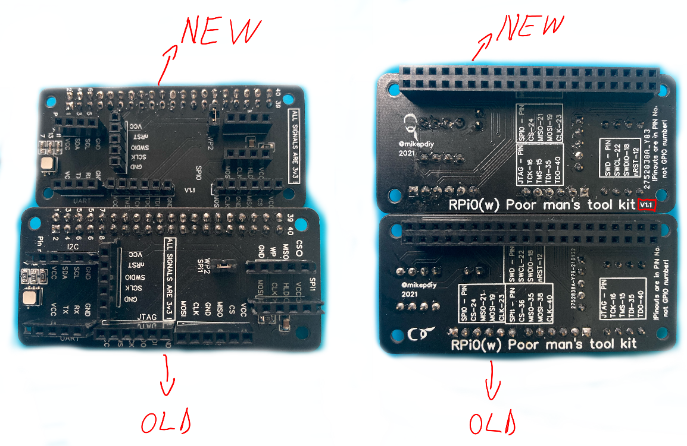

# Raspberry-PI-Maker-Toolkit

A multi protocol breakout HAT for Raspberry Pi that can work with all the models that have the 40 GPIO making this a versatile HAT for the maker in you plus the cheapest option to get into JTAG, SWDIO , SPI, I2C and UART . 
 I was sick and tired of using expensive brand's to flash my projects under windows and every single time I had to figure out what was wrong. What update was going to crash which part? Will it be the driver ? Maybe one of the softwares in the chain ? So I decied to try and use OpenOCD under linux as the Raspberry Pi is a great candidate to be used as an interface for it. Once I got all working ( on a RPI0W) I never looked back and it is very straight forward to get all working.  
 
 # Version Differences
 
 The Old version (V1.0) was only sold to 3 people but I also use it myself and I have realised that using SPI1 was just adding a layer of complexity instead of removing it. 
 I have decided to put both SPI slots on the SPI0 so that you don't have mess with config.txt and always remeber to disable the SPI1 after using it.  
 In V1.1 you can enable the SPI0 from raspi-config and leave that enabled no matter what other pins you will use on the board.  
 The schematics are available for both boards and the picture here will help to differentiate them also. 
 
 # Scripts 
 
 I have wrote 2 small bash scripts that you can use to get started with the board.  
 "install" is a script that will help you to install flashrom and OpenOCD while "poormanskit" is a script that will help you run thru the led's colors, flash thru SWD using OpenOCD, identify a memory IC over SPI using flashrom and a few other handy functionalities. 
 Please keep in mind that you need to make this scripts executable ( on raspbian OS "sudo chmod +x scriptname" ) .  
 For these scripts I have used a template for a bash menu that sadly I have forgotten where I got from but if you happen to be the author or know the author please open an issue and link me to where it can be found I give credit for it . 
 I will also include in the config folder a few configuration examples dedicated to atsamd21g18 : openocd.cfg ( config for openOCD to flash an "ATsamd21G18" with a bootloader named "bootloader_ib.bin") , reset.cfg ( will simulate thru SWD the double press of the reset button), reset_final.cfg ( will simulate single press on the reset button), test_ic.cfg (will check if it can read/see the IC thru the SWD line). 
 Folder structure for the scripts to work :  
 home/pi/ >contains<=> install,poormanskit,bootloader(dir),KBflash,openocd(created at install time of openocd)  
 bootloader/ >contains<=> bootloader_ib.bin(the bootloader to flash thru swd),openocd.cfg,reset.cfg,reset_final.cfg,test_ic.cfg  
 KBflash/ >contains<=> config(dir),firmware.uf2,format.uf2  
  
 In time I will add more details so come back time to time for updates or ask if there is anything that is unclear in the description .
 Ofc, you can modify all these to your heart's content or just write your own scripts. Mine are here to help out the people that are just starting and in need of a bit of help :-) .  
 

 
 # How to use it ?
 
 1.Jtag and SWD 
 For SWD and Jtag I personally used OpenOCD http://openocd.org/ and in order to use ti you have to build it from source .  
 A great guide for that was made by Adafruit a while back and can be found here : https://learn.adafruit.com/programming-microcontrollers-using-openocd-on-raspberry-pi  
 I have updated the guide a little bit and changed a few small details while making my guide a very simple list of comannds and steps thought I strongly recommned you read first the Adafruit guide as that will explain you the steps done and what they do while my guide is just focused on execution.  
 2. SPI 
 For SPI I am using Flashrom https://github.com/flashrom/flashrom and I also made a short guide to get that installed and then enable SPI .  
 using SPI0 is easy and straight forward and my board has the pinout made for the cheap adapter boards that come with the memory from various online vendors but in order to use SPI1, you have to enable that in the /boot/config.txt file and when you want to jump and use other protocols I suggest to turn it off as some of the pins used by it interffere with the other interfaces.  
 SPI0 doesn't have a resistor and capacitor to help with connection issues as they are assumed to pe present on the board that carries the memory ic but SPI1 has them implemented.  
 3. I2C  
 Here just use use whatever makes you comfortable. 
 4. UART  
 Again like with I2C just use what you want . 
 5. LED Indicator  
 The led indicator is present to offer the posibility to give visual feedback of the operations in your scripts.  
 
 # Can I use the information without the HAT ? 
 Yes you can and you just need some jumper wires but I made the HAT to aid my work .  
 The schematic of the HAT is also available so you can check it out and you can make your own board starting from it . 
  
  
 If you want to grab a HAT please find it here : https://www.tindie.com/products/22643/  
 
 
